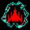

# RLUtils-Galaga
Reinforcement Learning Utilities for Galaga

## About

This repository provides utilities building datasets to train AI to play Galaga.

### Explosion Detection

Identifies frame(s) in which explosions of the player's ship are detected, and provides last-n moves that led to explosion.

### Kill Detection

Identifies frame(s) in which the player gets a kill, and provides last-n moves that led to explosion

### Data Format

Frames contain Numpy arrays of 3-channel pixel data as the first element and the associated "move" for each frame as the second.

* The first element of pixel data has a shape of (450, 358, 3)
* The second element is the move represented as one of the following one-hot vector encodings:
    
        [1, 0, 0, 0, ,0 ,0] # left + fire
        [0, 1, 0, 0, ,0 ,0] # right + fire
        [0, 0, 1, 0, ,0 ,0] # left
        [0, 0, 0, 1, ,0 ,0] # right
        [0, 0, 0, 0, ,1 ,0] # fire
        [0, 0, 0, 0, ,0 ,1] # (no move)
    
## Getting Started

### Pre-reqs

* Python >= 3.6
* Bandai Namco's "Arcade Game Series: Galaga" (Windows)

### About the sample data

There are 498 frames of sample data in `sample.npz`. You can decompress the file to make it easier to work with:

    >>> import numpy as np
    
    >>> f = np.load('./sample.npz')
    >>> sample = f['arr_0']
    >>> np.save('sample.npy', sample)
    
 Inspect the decompressed data:
 
    # If in a new shell...
    # >>> import numpy as np
    # >>> sample = np.load('./sample.npy')
    
    >>> sample.shape
    (498, 2)
    >>> frame_0 = sample[0]
    >>> frame_0[0].shape
    (450, 358, 3)
    >>> frame_0[1]
    [0, 0, 0, 1, 0, 0] # right
 
### View the frames

Make sure you have OpenCV installed. Then, debug each frame of the sample frames with:

    python view.py sample.npy

Use the keypad `6` to step forward through the frames, and `4` to step backwards. If you don't have a keypad, or want to change the forward and back keys, you can make the changes in the `debug_frame` method.

Use `q` to exit and destroy the window.

### Detecting Objects

We need to identify events to reward or penalize our RL model. We'll look for explosions of our hero's spacecraft as penalties and look to identify alien explosions or increases in score as rewards. 

To identify explosions, we can search the pixel-space (using [OpenCV's matchTemplate](https://www.docs.opencv.org/2.4/doc/tutorials/imgproc/histograms/template_matching/template_matching.html)) for images of explosions, like:

We can even highlight ship explosions in realtime, 

#### Alien Explosions (i.e., the reward)

These turned out to be tricky, especially when multiple ships explode in relatively the same space. We can look at changes in score as a reward for destroying an alien ship:

(TBD)

You can test the detection on the sample frames with

    python detect.py kills sample.npy # Enemy kills (alien explodes)

or

    python detect.py deaths sample.npy # Hero deaths (spaceship explodes)
